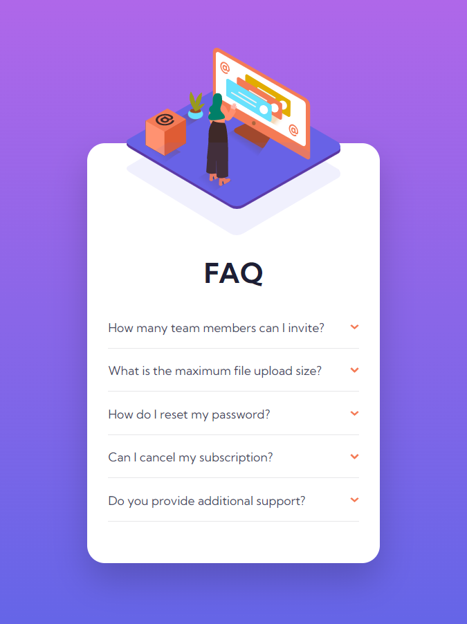
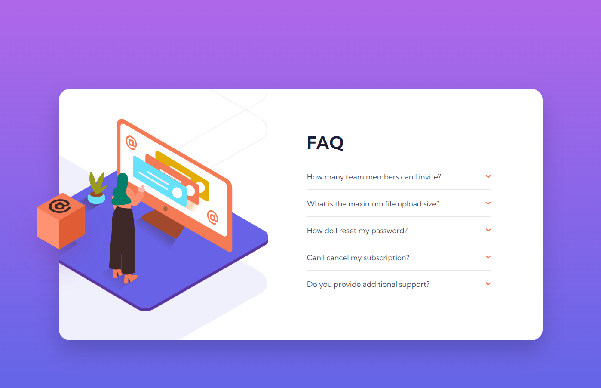

# Frontend Mentor - FAQ accordion card solution

This is a solution to the [FAQ accordion card challenge on Frontend Mentor](https://www.frontendmentor.io/challenges/faq-accordion-card-XlyjD0Oam). Frontend Mentor challenges help you improve your coding skills by building realistic projects.

## Table of contents

- [Overview](#overview)
  - [The challenge](#the-challenge)
  - [Screenshot](#screenshot)
  - [Links](#links)
- [My process](#my-process)
  - [Built with](#built-with)
  - [What I learned](#what-i-learned)
  - [Useful resources](#useful-resources)
- [Author](#author)

## Overview

### The challenge

Users should be able to:

- View the optimal layout for the component depending on their device's screen size
- See hover states for all interactive elements on the page
- Hide/Show the answer to a question when the question is clicked

### Screenshot




### Links

- Solution URL: [Add solution URL here](https://your-solution-url.com)
- Live Site URL: [Add live site URL here](https://your-live-site-url.com)

## My process

### Built with

- Semantic HTML5 markup
- Flexbox
- CSS Grid
- Mobile-first workflow
- JavaScript DOM

### What I learned

Learning how to open and close answer when the button question is clicked.

Hide the answer element
Code HTML FAQ Element:

```html
<li class="faq__item">
  <button id="btnQuestion" class="faq__btn">
    How many team members can I invite?
    
  </button>
  <p class="faq__answer">
    You can invite up to 2 additional users on the Free plan. There is no limit
    on team members for the Premium plan.
  </p>
</li>
```

To hide the answer element, I use CSS property overflow:hidden. Also, set the height of the element to only show the question.
```css
.faq__item {
  max-height: 200px;
  height: 15px;
  overflow: hidden;
  border-bottom: 1px solid var(--light-grayish-blue);
  padding: 17px 0;
  transition: all 200ms;
}
```

When the button answer is clicked, the program will check the current height FAQ element.
If the height is not the same, then the answer element will open, and if not it will be closed.

These are the JavaScript code snippets that I use to solve this challenge.
function for adjust height of FAQ element: 
```js
const toggleFaqHeight = (currentHeight, actualHeight, answerHeight) => {
  const minHeight = 15;
  return currentHeight !== actualHeight
    ? `${answerHeight}px`
    : `${minHeight}px`;
};
```

Function for set the new height FAQ element to the HTML.
```js
const setHeightFaqItem = (faqItem, answerElem) => {
  const paddingFaq = 17;
  const btnQestionHeight = 18;

  const answerHeight = answerElem.offsetHeight + paddingFaq;
  const actualFaqHeight = answerHeight + paddingFaq + btnQestionHeight;

  faqItem.style.height = toggleFaqHeight(
    faqItem.offsetHeight,
    actualFaqHeight,
    answerHeight
  );
};
```

Another function for change rotation arrow icon when button question is clicked.
```js
const rotatingArrowIcon = (imgArrow) => {
  imgArrow.classList.toggle('faq__arrow--up');
}
```

this function is used for open and close answer element.
```js
const toggleExpandAnswer = (event) => {
  const btn = event.srcElement;
  const imgArrow = btn.lastElementChild;
  const faqItem = btn.parentElement;
  const answerElem = btn.nextElementSibling;

  btn.classList.toggle('faq__btn--clicked');
  setHeightFaqItem(faqItem, answerElem);
  rotatingArrowIcon(imgArrow);
}
```

Adding event listener to the button question element for running program:
```js
const btnQuestions = document.querySelectorAll('#btnQuestion');
btnQuestions.forEach(btn => {
  btn.addEventListener('click', toggleExpandAnswer);
});
```

### Useful resources

- [MDN Web Docs](https://www.example.com) - Great resource to read the documentation like HTML, CSS and JavaScript.
- [CSS-Tricks](https://css-tricks.com/) - Give us many tricks to use CSS properties for styling website.

## Author

- Website - [Alfan Wahyudi](https://alfanwahyudi.github.io/)
- Frontend Mentor - [@AlfanWahyudi](https://www.frontendmentor.io/profile/AlfanWahyudi)
- Twitter - [@Wahyudi_Alfann](https://www.twitter.com/Wahyudi_Alfann)
